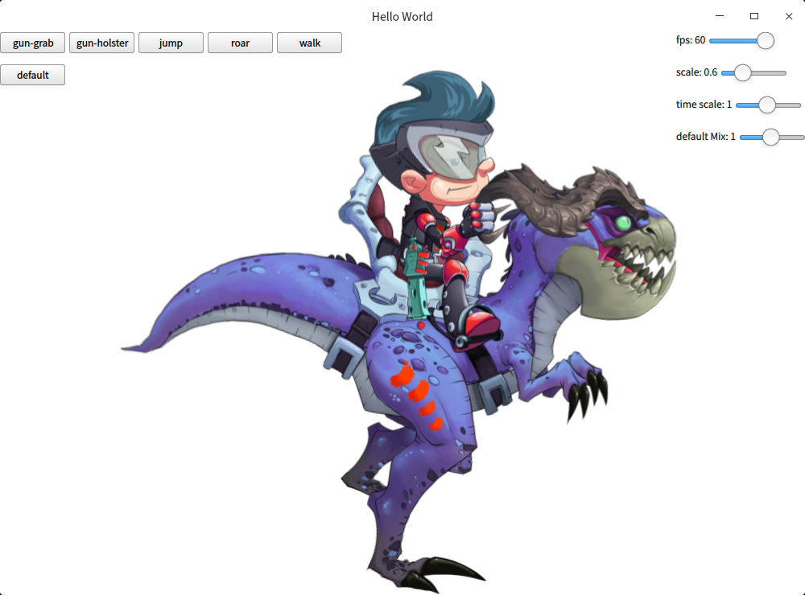
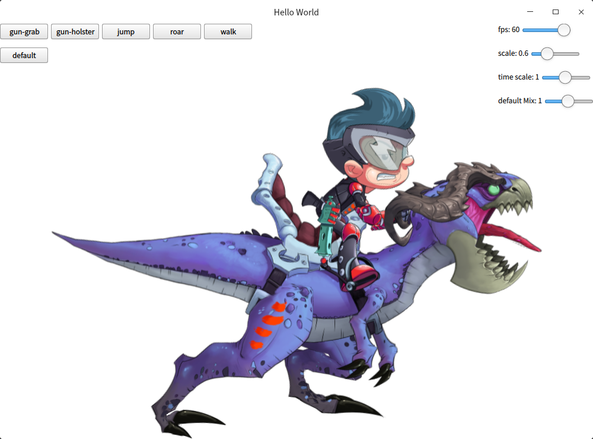

# qspine
spine runtime support for qt qml with spine-cpp 3.x

thanks for [spine-qml](https://github.com/irukandji/spine-qml)

screenshot:

currently support:
 - real time timescale
 - real time fps
 - real time animation mixing
 - real time skins 
 - real time animation
 - skeleton scale(force to reload)
 - async loading
 - debug bones
 - debug slots

 todo:
 - deug vertices
 - clipping
 - complex blendMode (some errors)
 - animation cache
 - multi threading simulation